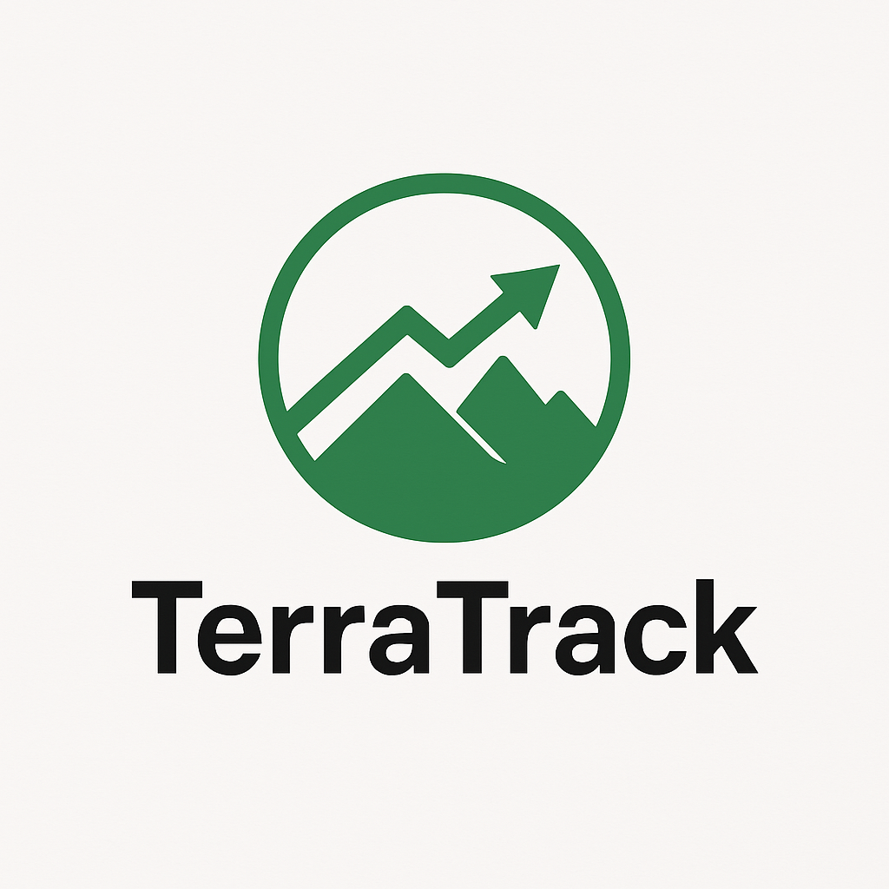

<p align="left">
  
</p>

🛰️ **TerraTrack** is an open-source, cloud-based workflow for detecting and monitoring slow-moving landslides using Sentinel-2 imagery and optical feature tracking (FT).

It is fully reproducible via Google Colab and supports scalable motion analysis using multiple tracking methods, terrain filtering, and time series reconstruction.

---

## 📒 Get Started

### ▶️ Run in Google Colab (Recommended)

Click the badge below to launch:

[](https://colab.research.google.com/github/lorenzonava96/TerraTrack/blob/main/notebooks/TerraTrack_v1.ipynb)

---

### 🖥️ Run Locally

```bash
git clone https://github.com/lorenzonava96/TerraTrack.git
cd TerraTrack
jupyter notebook notebooks/TerraTrack_v1.0.ipynb
```

---

## Features

- Automated Sentinel-2 image acquisition via Earth Engine API
- Multiple feature tracking methods:
  - FFT-based Normalized Cross-Correlation (**FFT-NCC**)
  - Phase Cross-Correlation (**PCC**)
  - Median Dense Optical Flow (Farneback)
- Custom filtering pipeline:
  - Magnitude, angular coherence, PKR/SNR thresholds
  - Slope/aspect-based filtering, clustering
- Time series reconstruction using weighted or midpoint binning
- Export-ready, georeferenced median velocity maps and displacement time series, compatible with InSAR Explorer in QGIS.

## Repository Structure
```bash

TerraTrack/
├── notebooks/           # Main notebook(s)
├── src/                 # Python modules (optional)
├── figures/             # Logo, plots, visuals
├── requirements.txt     # Dependencies for local + Colab
├── LICENSE
└── README.md

```
## License

This project is licensed under the [MIT License](LICENSE).

## Citation

A peer-reviewed paper describing TerraTrack is currently in preparation. Citation details will be provided once available.

## Feedback & Support

Have questions, suggestions, or found a bug? Feel free to [open an issue](https://github.com/lorenzonava96/TerraTrack/issues).


